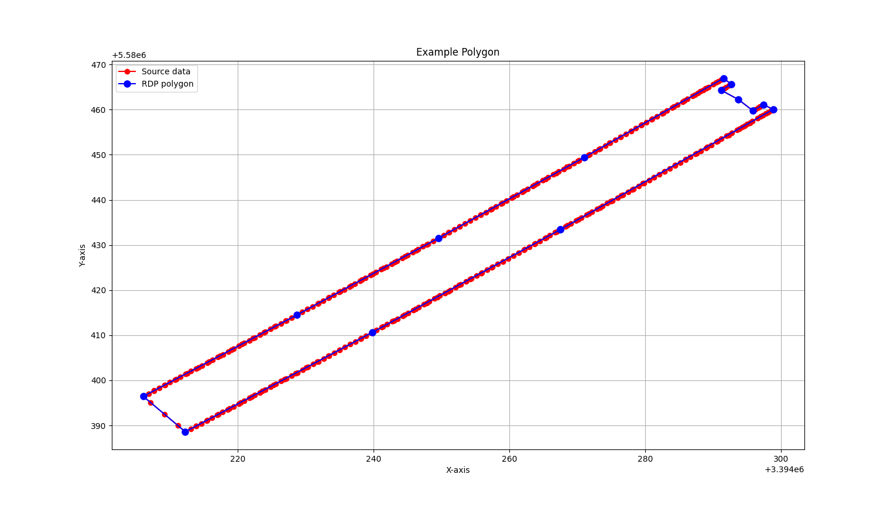
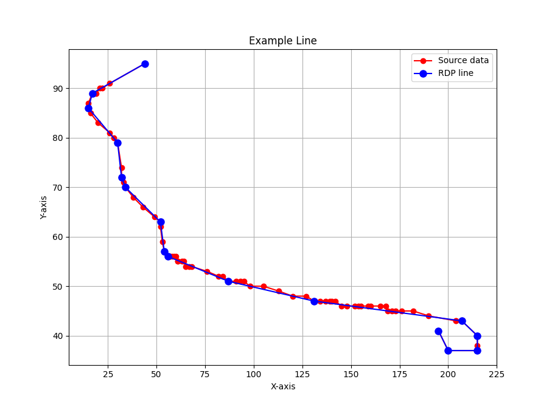
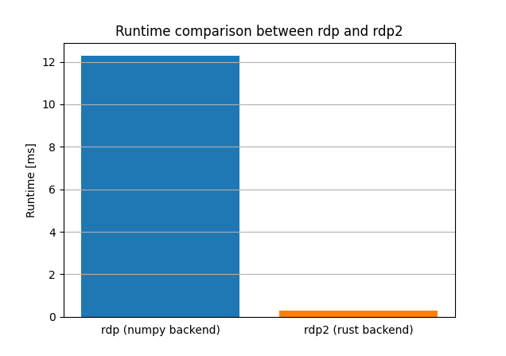

# Ramer-Douglas-Peucker Algorithm

This repository contains a high-performance Python library, implemented in Rust, for the Ramer-Douglas-Peucker algorithm.

The Ramer–Douglas–Peucker algorithm is an algorithm that decimates a curve composed of line segments to a similar curve with fewer points [[1](https://en.wikipedia.org/wiki/Ramer%E2%80%93Douglas%E2%80%93Peucker_algorithm)].


## Installation
```sh
pip install rdp2
```

## Usage
Works with `list`s, `tuple`s, numpy `ndarray`s and any mixture of the three types, e.g. `list[tuple(float, float)]`. 

### List
```py
from rdp2 import rdp

rdp([[1, 1], [2, 2], [3, 3], [4, 4]], 1.0)
# result: [[1, 1], [4, 4]]
```

### Tuple
```py
from rdp2 import rdp

rdp(((1, 1), (2, 2), (3, 3), (4, 4)), 1.0)
# result: [[1, 1], [4, 4]]
```

### Numpy ndarray
```py
import numpy as np
from rdp2 import rdp

rdp(np.array([1, 1, 2, 2, 3, 3, 4, 4]).reshape(4, 2), 0.5)
# result: array([[1, 1], [4, 4]])
```

## Examples



## Acknowledgment 
This project is heavily inspired by the work of [Fabian Hirschmann](https://github.com/fhirschmann). He originally published the first [rdp](https://github.com/fhirschmann/rdp) package, which I came across when looking for an implementation of the RDP algorithm. 

The [`bench.py`](./python/bench.py) script provides a runtime comparison between Hirschmann's `rdp` and this repos `rdp2`.




## License
This project is licensed under the GPLv3 License.